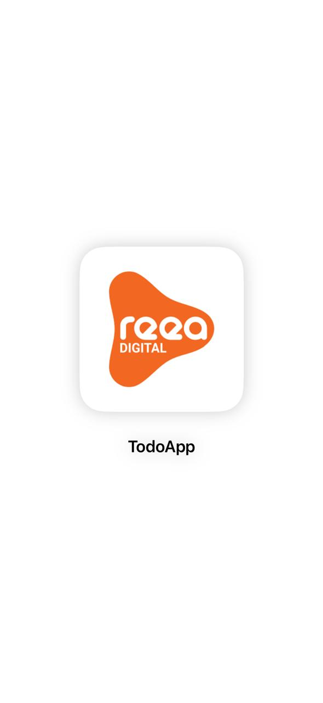
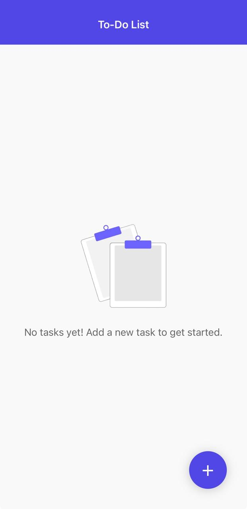
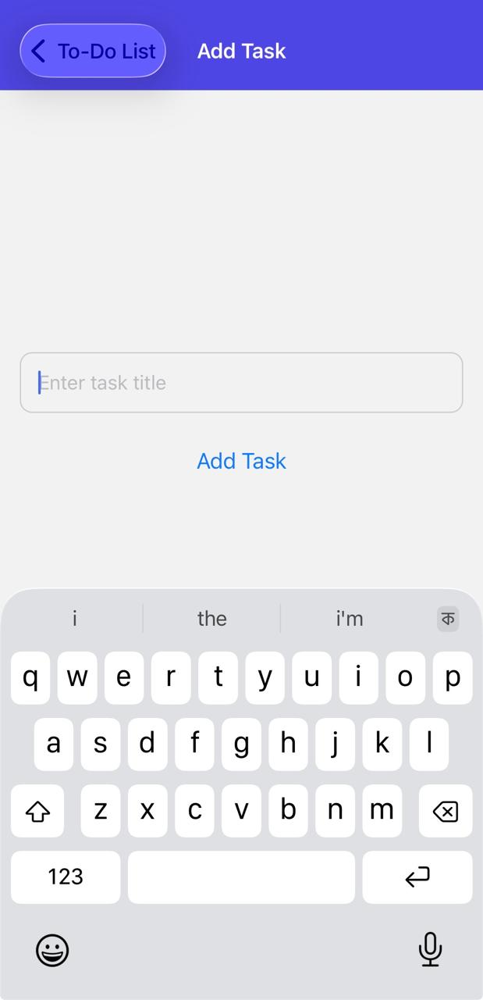
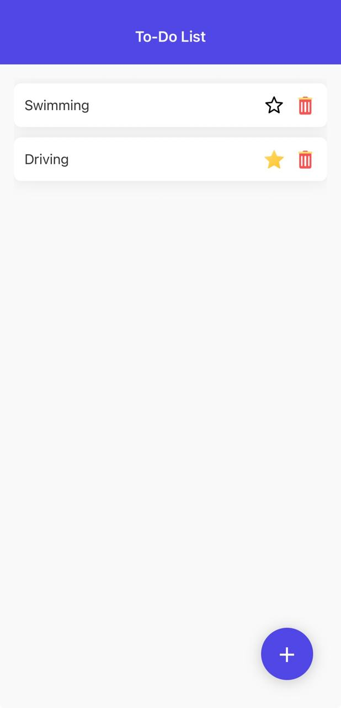

# 📱 To-Do List App - Expo React Native
A beautiful and intuitive To-Do List application built with React Native Expo that helps you stay organized and productive.

# ✨ Features

## 📋 Task Management

- **Add Tasks - Quick task creation with floating action button**
- **Delete Tasks - Remove unwanted tasks with intuitive trash icon**
- **Favorite Tasks - Mark important tasks with star icon**
- **Complete Tasks - Check off completed items**

---

## 🛠 Technologies Used

- **React Native (Expo CLI)**
- **TypeScript for type safety**
- **React Navigation (Native Stack)**
- **AsyncStorage for local data persistence**
- **FlatList for efficient task rendering**
- **StyleSheet API for styling**

---

## ⚙️ Setup Instructions

Follow these steps to run the app locally:

## 🔧 Setup

### Clone repo:

```bash
git clone <your-repo-url>
cd To-Do-List-App
```

---

## 🧩 Install dependencies

```bash
npm install
# or
yarn install
```

---

## Run Application Command for Android

```bash
npm start
```
## 📝 Scripts
```bash
npm start          # Start development server
npm run android    # Run on Android
npm run ios        # Run on iOS
npm run web        # Run on web
```

## Alternative: Expo Go App

- **Scan the QR code with Expo Go app (Android)**
- **Use Camera app to scan QR code (iOS)**
---

## 📁 Project Structure
```text
TodoApp/
├── assets/
│   ├── icons/          # App icons and UI icons
│   └── images/         # App images and illustrations
├── src/
│   ├── components/     # Reusable components
│   │   ├── TaskCard.tsx
│   │   ├── FloatingButton.tsx
│   │   └── EmptyList.tsx
│   ├── screens/        # App screens
│   │   ├── HomeScreen.tsx
│   │   └── AddTaskScreen.tsx
│   ├── navigation/     # Navigation configuration
│   │   └── AppNavigator.tsx
│   ├── utils/          # Helper functions
│   │   ├── storage.ts
├── App.tsx             # Main app component
└── package.json
```
---
## 🎯 Usage
```text
1. Adding a Task
2. Tap the floating ➕ button
3. Enter your task description
4. Press "Add Task" or hit enter
```

## 📸 Screenshots






## 🎬 Animated GIF App
